> ## ⚠️ NOTICE FOR AI AGENTS AND FUTURE READERS
>
> **This file is UNRELATED to the Sourashtra Learner Webapp.**
>
> It is personal interview-preparation notes, parked in this repository purely
> so it can be read on a phone through GitHub's markdown renderer. It is not
> documentation, not a spec, not a design note, and not a source of truth for
> anything in this project.
>
> - **Do not** treat it as context for the Sourashtra app.
> - **Do not** modify, refactor, lint, or "integrate" it.
> - **Do not** cite it when reasoning about this codebase.
> - It is temporary and safe to delete after **18 Sep 2026**.

---

# CMT Interview Booklet
### Machine Learning Engineer II — Interview with Ce Liu, Senior Director of AI (Foundation Models)
**Fri 18 Sep 2026, 9:30–10:15 ET · Google Meet · No coding, technical discussion only**

---

## How to use this booklet

Work top to bottom. Each part ends with **"Say this out loud"** — a compressed answer you should be able to deliver in 60–90 seconds without notes. If you can't say it out loud, you don't know it yet.

The last two sections (Rapid-Fire Drill, One-Page Cheat Sheet) are for the final 30 minutes and for the morning of.

| Block | Time | Part | Topic |
|---|---|---|---|
| 1 | 15 min | 0 | Who he is, what CMT builds |
| 2 | 20 min | 1 | The lineage: contrastive → generative → unified |
| 3 | 55 min | 2 | GIT · Florence-2 · SupCon · Phi-4 |
| 4 | 35 min | 3 | IMU2CLIP and sensor self-supervision |
| 5 | 30 min | 4 | Tokenizing a sensor stream |
| 6 | 25 min | 5 | Pretraining objectives |
| 7 | 40 min | 6 | Long-tail, calibration, noisy labels |
| 8 | 20 min | 7 | Evaluation, deployment, regulation |
| 9 | 30 min | 8 | **Capstone: design DriveWell Atlas** |
| 10 | 30 min | 9–10 | Drill + questions to ask him |

---

# Part 0 — Context (15 min)

## 0.1 Ce Liu

| | |
|---|---|
| **Credentials** | IEEE Fellow · h-index 72 · ~64,000 citations · i10 112 |
| **PhD** | MIT CSAIL, 2009 — *"Beyond Pixels: Exploring New Representations and Applications for Motion Analysis"*, advised by Bill Freeman & Ted Adelson |
| **Career arc** | Microsoft Research New England → Google Research → Microsoft → Meta GenAI → **CMT** |
| **Stated interests** | Foundation models, GenAI, computer vision, graphics, ML |

**His publication eras — useful because each era has a lesson:**

```
2001–2014   Classical vision & graphics
            Texture synthesis · Noise estimation · SIFT Flow ·
            Motion Magnification · Video super-resolution · Deconvolution
            LESSON: he thinks in signals, motion, and physics — not just tokens.

2020–2021   Representation learning at Google
            Supervised Contrastive Learning · MaskGIT · NeRD
            LESSON: how to shape an embedding space.

2021–2023   Foundation models at Microsoft
            Florence · GIT · MM-ReAct · Florence-2
            LESSON: unify tasks, simplify architecture, build a data engine.

2024        Frontier scale at Meta / Microsoft
            Llama 3 · Movie Gen · Phi-4
            LESSON: data curation is the product.
```

**The single most important thing to internalise:** he started his career on *motion analysis from sensor-like signals* and ended it on *foundation models*. CMT is where those two halves meet. He did not take this job to do incremental fine-tuning — he took it to build a sensor foundation model from first principles. Interview accordingly.

## 0.2 CMT

**Business:** smartphone-and-sensor telematics. Measure how people drive → price insurance, detect crashes, coach drivers.

| Product | What it does |
|---|---|
| DriveWell **Risk** | Behaviour-based risk scoring → insurance premiums |
| DriveWell **Crash & Claims** | Real-time crash detection → emergency response + claims |
| DriveWell **Engage** | Personalised coaching, distraction reduction |
| DriveWell **Fusion** | Real-time sensor analytics platform |
| DriveWell **Atlas** | *"A breakthrough foundation model for mobility intelligence"* — **this is the job** |

**Data sources:** phone IMU (accelerometer, gyroscope), GPS, barometer, magnetometer; the DriveWell **Tag** (a vehicle-mounted Bluetooth sensor that pairs with the phone); plus vehicle and video data in parts of the portfolio.

**Customers:** State Farm, Progressive, Nationwide, Travelers, Farmers, AXA, Uber, Verizon.

> ⚠️ **Do not say "you're a dashcam company."** CMT's core is smartphone-based. Video exists in the portfolio but it is not the flagship. What you *can* say is that **wherever paired video exists, his Meta/Microsoft stack transfers directly** — that's a compliment and a strategy, not a factual claim about their products.

## 0.3 The thesis of the whole interview

```
              HIS BACKGROUND                    CMT'S PROBLEM
        ┌──────────────────────┐          ┌──────────────────────┐
        │ Motion from signals  │          │ Motion from IMU/GPS  │
        │ Contrastive spaces   │  ──────► │ Few labels, huge log │
        │ Unified seq2seq FMs  │          │ Zoo of task models   │
        │ Data engines at scale│          │ Billions of miles    │
        └──────────────────────┘          └──────────────────────┘
                              ╲          ╱
                               ╲        ╱
                          "DriveWell Atlas"
```

**Say this out loud:** *"Atlas is the same bet Florence-2 made, moved from pixels to sensor streams: one pretrained backbone over an enormous unlabeled corpus, a unified interface for a zoo of downstream tasks, and an automated data engine instead of human labelling."*

---

# Part 1 — The Lineage (20 min)

You already have CLIP → LLaVA → Modern VLM. Here is the full ladder with Ce Liu's work slotted in. **Memorise the ladder, not the details.** The details hang off it.

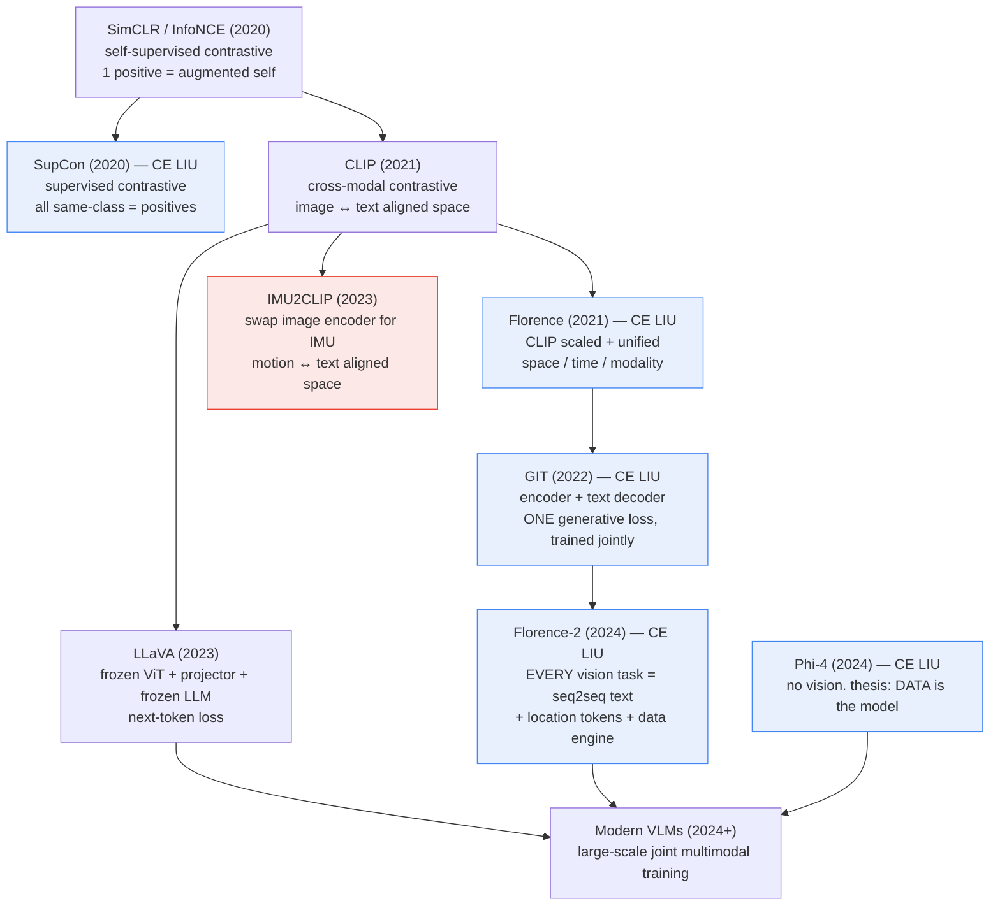

## The three-way distinction, cold

This is the highest-probability question in the interview. Have all three, not just two.

| | **CLIP** | **GIT** | **LLaVA** |
|---|---|---|---|
| Loss | Contrastive (InfoNCE) | Next-token (LM) | Next-token (LM) |
| Text side | Text **encoder** | Small text **decoder**, from scratch | Pretrained **LLM**, mostly frozen |
| Vision side | Image encoder | Image encoder, **trained jointly** | Pretrained encoder, **frozen** |
| Bridge | Shared embedding space | Linear + LayerNorm, then concatenate | Projector (linear v1 / MLP v1.5) into LLM token space |
| Output | An embedding | Free text | Free text |
| Can it reason? | No | Weakly | Yes — inherits the LLM |
| Cost | Medium | High (train everything) | Low (train the projector) |

**Say this out loud:**

> *"CLIP learns an aligned embedding space between two modalities with a contrastive loss — the output is a vector, not language. GIT and LLaVA both generate language, but differently: GIT trains a vision encoder and a small text decoder jointly under a single language-modelling loss — it still projects image features with a linear layer and LayerNorm, but it drops the object detector and all the auxiliary losses prior systems used. LLaVA instead reuses a pretrained vision encoder and a pretrained LLM and only learns a projector that maps visual features into the LLM's token space, so it inherits the LLM's reasoning cheaply. GIT is more end-to-end; LLaVA is more compute-efficient and smarter out of the box."*

---

# Part 2 — The Four Papers (55 min)

## 2.1 GIT — Generative Image-to-text Transformer (2022, Microsoft) · 15 min

### The problem it attacked

Pre-GIT vision-language systems were Rube Goldberg machines: an object detector producing region proposals, region features, multiple auxiliary losses (image-text matching, masked language modelling, object tagging), and a separate head per task. GIT deleted all of it.

### Architecture

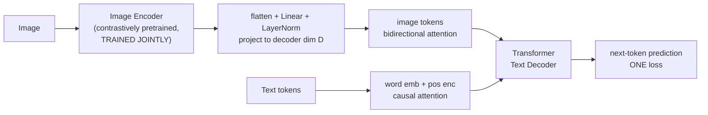

### Key facts

- **One** encoder, **one** decoder, **one** language-modelling loss. No detector, no auxiliary objectives.
- There *is* a projection — image features are flattened and passed through a **linear layer + LayerNorm** to reach the decoder's dimension, then concatenated with text embeddings. The "simplicity" is about deleting the **object detector and the auxiliary losses** (image-text matching, masked LM, object tagging) that prior VLP systems stacked up — not about deleting the projection.
- Image tokens attend bidirectionally (they're all available at once); text tokens attend causally (autoregressive generation).
- Scaled to ~0.8B image-text pairs; the largest variant went far beyond.
- SOTA on COCO captioning, VQA, and **first system to exceed human performance on TextCaps**.
- Video captioning came almost for free: concatenate per-frame features, same model, same loss.

### The lesson he actually believes

> **Simplify the architecture. Scale and clean the data. The architecture is not where the win is.**

If you propose an elaborate multi-branch, multi-loss design in this interview, you are arguing against his instincts. Default to simple, then justify any complexity you add.

### CMT relevance

CMT almost certainly has a zoo: a crash model, a hard-braking model, a distraction model, a trip-segmentation model, a driver-vs-passenger model, a risk scorer. GIT's argument says: collapse them. One backbone, one loss, one interface.

**Say this out loud:** *"GIT's thesis is architectural minimalism — one image encoder, one text decoder, one generative loss, and then scale the data. It proved you don't need object detectors or auxiliary objectives to hit SOTA on captioning and VQA."*

---

## 2.2 Florence-2 (2024, Microsoft) · 20 min — **the most important paper for this interview**

### The idea

**Every vision task becomes text generation, selected by a prompt.** Detection, captioning, OCR, grounding, segmentation, region description — one model, one loss, differing only by the prompt string.

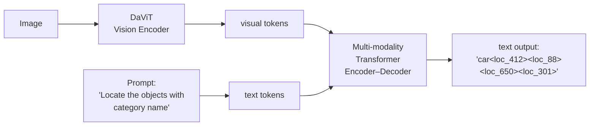

### Trick 1 — Location tokens ⭐ (the transferable idea)

A bounding box is four **continuous** numbers. Florence-2 quantises each coordinate into ~1000 bins and adds those bins to the **vocabulary** as special tokens `<loc_0> … <loc_999>`. A box is now literally four tokens in a text sequence.

```
    continuous coordinate          discrete token
    x = 0.4123  ──── quantise ────► <loc_412>

    Consequence: detection, segmentation, grounding, captioning
    all become the SAME cross-entropy loss over ONE vocabulary.
```

**Hold this idea.** It is exactly how you might tokenise an accelerometer reading. See Part 4.

### Trick 2 — The data engine (FLD-5B)

**5.4 billion annotations over 126 million images, produced with essentially no exclusive human labelling.**

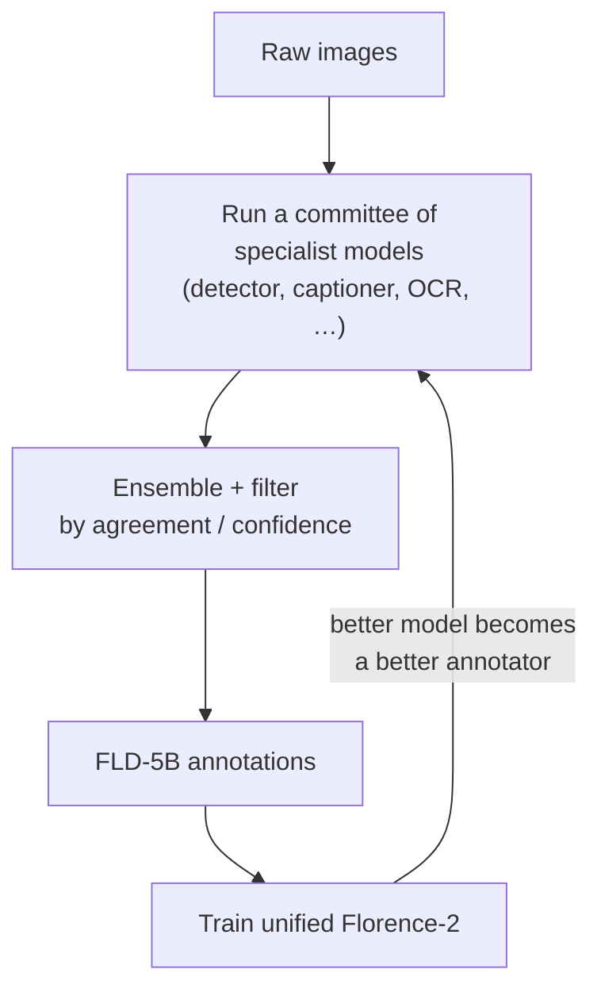

Iterative: annotate → filter → train → re-annotate. The model bootstraps its own supervision.

### Trick 3 — Small wins

Florence-2 ships at **0.23B and 0.77B parameters** and beats models many times larger. Good data beats big weights. This matters enormously when inference has to run on a phone or an embedded tag.

### CMT relevance — spell this out in the interview

| Florence-2 | DriveWell Atlas equivalent |
|---|---|
| One model, many vision tasks, prompt-selected | One backbone, many telematics tasks |
| Location tokens (quantise coordinates) | Quantise sensor values / event times into tokens |
| FLD-5B auto data engine | Auto-label billions of miles with a model committee |
| 0.23B model beats giants | Small enough to distil to the edge |

**Say this out loud:** *"Florence-2 unified every vision task into one prompted sequence-to-sequence problem. The two tricks that made it work were location tokens — quantising continuous coordinates into vocabulary entries so one cross-entropy loss covers everything — and an automated data engine that produced 5.4 billion annotations by ensembling specialist models and iterating, rather than by human labelling."*

---

## 2.3 Supervised Contrastive Learning — SupCon (2020, Google) · 12 min

### The one-sentence idea

Self-supervised contrastive learning has **one positive** per anchor (a different augmentation of the same image). If you have labels, use **every same-class sample in the batch** as a positive.

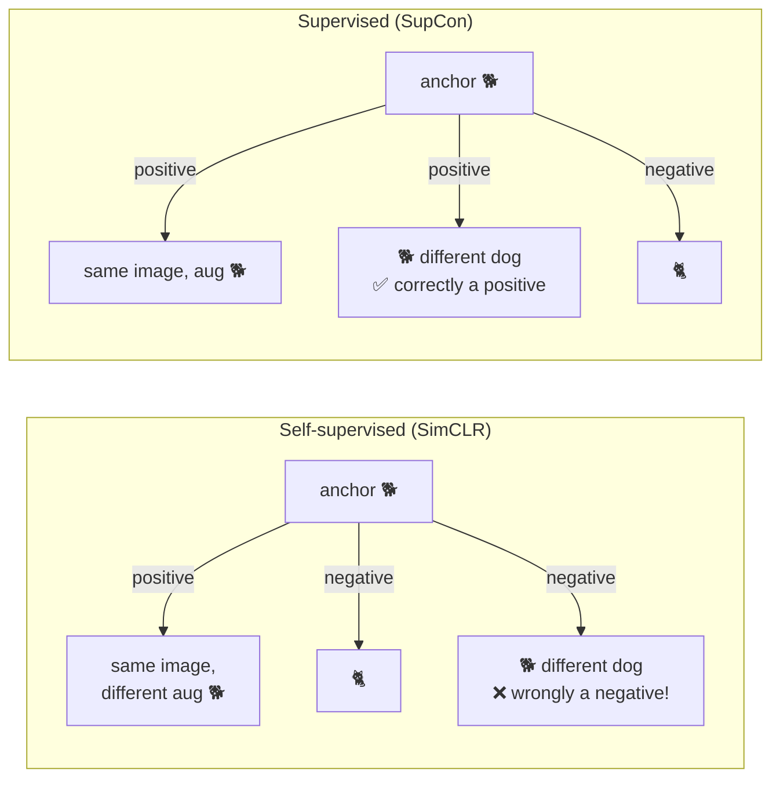

### The loss

$$\mathcal{L}^{sup}=\sum_{i\in I}\frac{-1}{|P(i)|}\sum_{p\in P(i)}\log\frac{\exp\!\big(z_i\!\cdot\! z_p/\tau\big)}{\sum_{a\in A(i)}\exp\!\big(z_i\!\cdot\! z_a/\tau\big)}$$

- $P(i)$ = all other samples in the batch with the same label as $i$
- $A(i)$ = everything in the batch except $i$
- $\tau$ = temperature — **low τ sharpens focus on hard negatives**, high τ softens it
- Detail worth knowing: the paper found $\mathcal{L}_{out}$ (averaging **outside** the log) trains far better than $\mathcal{L}_{in}$.

### Why it beats cross-entropy — the intuition

```
Cross-entropy only needs a decision boundary:        SupCon shapes the whole space:

     🐕 🐕      │      🐈 🐈                            (🐕🐕🐕)        (🐈🐈🐈)
   🐕    🐕     │   🐈    🐈                              tight           tight
      🐕  🐕    │     🐈  🐈                             cluster        cluster
                │                                              far apart
   loose, stringy clusters — fine for              tight, isotropic clusters —
   accuracy, fragile under corruption              robust, transfers better
```

**Results:** ImageNet top-1 **78.7%** (ResNet-50) vs **77.0%** for cross-entropy; ~81.4% with ResNet-200. Substantially more robust on ImageNet-C (corruptions), and less sensitive to optimiser/augmentation hyperparameters.

### CMT relevance

CMT is neither fully labelled nor fully unlabelled — it's in between:

```
  billions of miles UNLABELLED          ──► self-supervised pretraining
  millions of weak labels                ──► SupCon
  (hard brake, speeding, phone use)
  thousands of verified crashes          ──► supervised head
```

SupCon is the bridge for the middle tier. And the tight-cluster property is exactly what you want when the downstream consumer is a **k-NN retrieval** ("find similar risky trips") or a **calibrated risk score**.

**Say this out loud:** *"SupCon generalises the contrastive loss to the supervised setting by treating all same-class samples in the batch as positives instead of just the augmented view. Cross-entropy only has to find a separating hyperplane, so its clusters stay loose; SupCon actively pulls classes together and pushes them apart, which gives tighter embeddings, better robustness to corruption, and better transfer."*

---

## 2.4 Phi-4 (2024, Microsoft) · 8 min

### The thesis

**Data quality is the model.** A 14B-parameter model, trained on a majority-synthetic, aggressively curated corpus, **outperforms its own teacher (GPT-4) on STEM reasoning benchmarks** like GPQA and MATH.

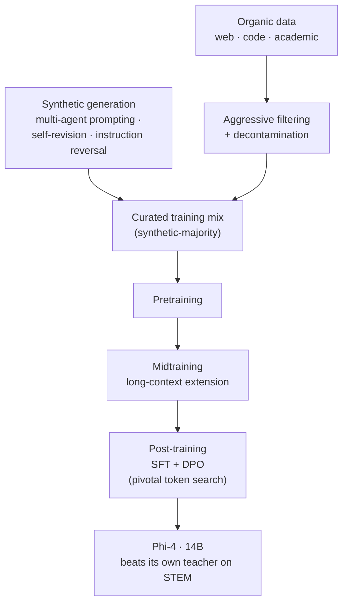

Three points to remember:
1. **Synthetic data done well is not a hack** — structured generation with verification loops produces training signal that doesn't exist in scraped data.
2. **Decontamination matters** — they went to real lengths to prove benchmark results weren't leakage.
3. **Small models punch above their weight** when the data is right.

### CMT relevance

- **Synthetic rare events.** You cannot collect a million crashes. You can simulate them — physics simulation, crash-test data, signal augmentation. Phi-4 is the argument that this is a legitimate primary strategy, not a fallback.
- **Edge deployment.** A 0.2B model that works beats a 7B model you can't ship to a phone.

**Say this out loud:** *"Phi-4's thesis is that data quality dominates scale. It's 14B parameters trained largely on synthetic data generated through multi-agent prompting and self-revision, plus heavily filtered organic data — and it beats GPT-4, its own teacher, on STEM reasoning. For a domain like telematics where the events you care about are vanishingly rare, that's the licence to treat synthetic data generation as a first-class part of the pipeline."*

---

# Part 3 — IMU2CLIP and Sensor Self-Supervision (35 min)

## 3.1 IMU2CLIP (Meta, 2023) — **the closest existing work to Atlas**

### The idea

Take CLIP. Replace the image encoder with an **IMU encoder**. Align motion with language and video.

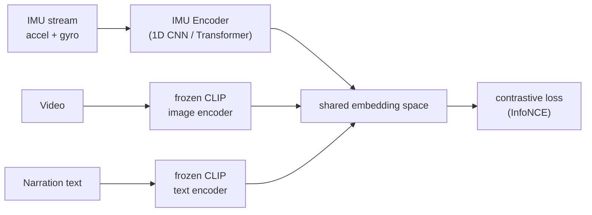

**Training data:** Ego4D — egocentric video with **synchronised IMU + video + human narrations**. That temporal synchronisation is what makes the alignment free: you don't need anyone to label the IMU, the paired video and narration *are* the label.

### What it unlocks

| Capability | Example |
|---|---|
| Zero-shot activity recognition | Classify motion with no motion labels, using text class names |
| Text → sensor retrieval | "find moments where someone is climbing stairs" |
| Sensor → text retrieval | Describe what a motion signature means |
| Sensor as a video substitute | Run a video-trained task off IMU alone (cheap, private, low-power) |

### Why this is the paper to bring up

Apply it verbatim to CMT and you get:

```
  "find me aggressive merges on wet roads at night"   ← natural-language search
                                                          over billions of miles

  zero-shot event classification                       ← no per-event labels needed

  "You braked late approaching the intersection."      ← grounded coaching text
```

And if CMT has **any** paired video + IMU, they have the Ego4D setup exactly. He came from Meta; there's a real chance he knows this work directly.

## 3.2 Supporting papers — skim, don't study

| Paper | One line | Why it matters here |
|---|---|---|
| **LIMU-BERT** (SenSys 2021) | BERT-style masked reconstruction on IMU, tiny model | Existence proof that SSL works on mobile sensor data |
| **Chronos** (Amazon 2024) | Mean-scale a series, **quantise into bins**, train an off-the-shelf T5 on bin indices | The simplest "how do I tokenise a signal" answer — and note it rhymes with Florence-2's location tokens |
| **PatchTST** (ICLR 2023) | Patch the series into sub-sequences as tokens; channel-independent | The continuous-patch alternative |
| **TimesFM / Moirai / MOMENT / Lag-Llama** | Time-series foundation models, 2024 | Know they exist. **Know the caveat:** they target *forecasting*, not rare-event detection — they don't solve CMT off the shelf |
| **MaskGIT** (his, CVPR 2022) | Discrete VQ tokens + bidirectional transformer + iterative parallel decoding | The template if you go the learned-codebook route |

**Say this out loud:** *"IMU2CLIP is the closest published analogue to what Atlas has to be. It swaps CLIP's image encoder for an IMU encoder and aligns motion against video and text using Ego4D's synchronised streams — so the pairing itself provides supervision, with no motion labels. That buys you zero-shot recognition, natural-language retrieval over sensor data, and a path to generating grounded coaching text."*

---

# Part 4 — Tokenising a Sensor Stream (30 min)

> **This is the highest-probability deep technical question in the interview.** He spent five years on how to turn pixels into tokens. He now has to turn accelerometer traces into tokens. He will want to think out loud with you about it.

## 4.1 The problem

```
  Raw input:  a 20-minute drive
              accel_x, accel_y, accel_z   ┐
              gyro_x,  gyro_y,  gyro_z    │  ~50–100 Hz  →  ~10⁵–10⁶ samples
              GPS lat, lon, speed, course │  ~1 Hz
              barometer, magnetometer     ┘

  Needed:     a sequence of tokens a transformer can consume,
              at a length that is actually trainable.
```

## 4.2 The four options

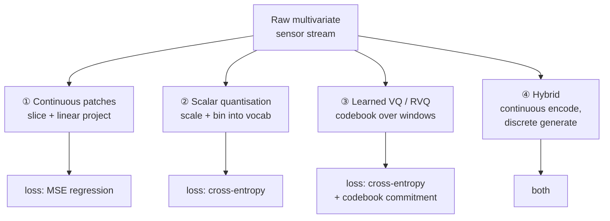

| | How | Pros | Cons | Precedent |
|---|---|---|---|---|
| **① Continuous patches** | Slice into fixed windows, linear-project each window to a $d$-dim token | Lossless; simple; one training stage | MSE blurs multimodal futures; no sampling; no likelihood | PatchTST, MAE, ViT |
| **② Scalar quantisation** | Mean-scale, bin each value into $K$ buckets, bucket index = token | Reuses the entire LM stack; cross-entropy naturally models multimodal distributions; gives a **likelihood** | Precision loss; bin edges arbitrary; awkward across correlated channels | Chronos, **Florence-2 location tokens** |
| **③ Learned VQ / RVQ** | VQ-VAE codebook over multivariate windows; residual stages for fidelity | Learned and compact; handles channel coupling jointly; enables MaskGIT-style parallel decoding | **Codebook collapse**; extra training stage; reconstruction bottleneck caps quality | MaskGIT, EnCodec, SoundStream |
| **④ Hybrid** | Continuous tokens into the encoder; discrete head only where you need generation | Best of both | Two systems to tune | Common in practice |

**A defensible default:** start with ① continuous patches, because it's one stage and lossless. Add a discrete head (② or ③) only when you need a *likelihood* (for anomaly scoring) or *generation* (for synthetic data). Say it that way — showing you'd add complexity only against a requirement is exactly the instinct GIT and Florence-2 reward.

## 4.3 The sensor-specific decisions — ⭐ raise these unprompted

These are what separate "read some papers" from "has worked with real sensors." **This is your DexAI advantage.**

### (a) Patch length — and why one length is wrong

```
  crash impulse        ~20–100 ms      ←  needs fine patches
  hard brake           ~0.5–2 s
  lane change          ~2–5 s
  turn / manoeuvre     ~5–15 s
  trip-level risk      ~10–30 min      ←  needs pooling / hierarchy
```

Five orders of magnitude. **Answer: multi-scale or hierarchical patching**, not one window size. Fine tokens near the bottom, pooled tokens above.

### (b) Coordinate frame — the one that silently destroys models ⭐

A phone in a cupholder, a phone in a pocket, a tag on the windshield: each has an **arbitrary, unknown orientation**. Raw `accel_x` means nothing until you know which way is forward.

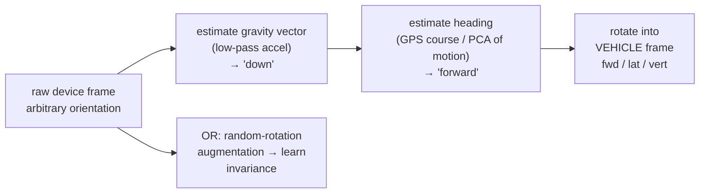

Two valid strategies — **canonicalise** (explicit rotation into vehicle frame) or **learn invariance** (random-rotation augmentation during pretraining). Best practice is usually both. Mentioning this is a strong credibility signal because it's an error you only learn by doing.

### (c) Channel handling

Generic time-series FMs (PatchTST, Moirai) often assume **channel independence** — sensible when forecasting unrelated variables. **Wrong here.** `accel_x/y/z` are three components of one physical vector; braking couples longitudinal accel with pitch. **Mix channels inside the patch embedding.** Being able to say *why* the generic recipe doesn't transfer is a good moment.

### (d) Sampling-rate normalisation

Different phones, OS versions, and battery states produce different and **jittery** sample rates. Resample to a canonical rate; consider feeding the true timestamp delta as a feature so the model is rate-aware rather than rate-fooled.

### (e) Normalisation

Per-trip? Per-device? Global? Per-trip normalisation removes device calibration bias but also destroys absolute magnitude — and **absolute magnitude is the crash signal**. Don't normalise away the thing you're detecting.

### (f) Augmentations — your "views" for any contrastive objective

```
  rotation (SO(3))     time warping       jitter / sensor noise
  magnitude scaling    channel dropout    random temporal crop
  resampling           gravity re-projection
```

**Say this out loud:** *"Four families: continuous patches with a regression loss, scalar quantisation into a vocabulary like Chronos or Florence-2's location tokens, a learned VQ codebook like MaskGIT, or a hybrid. I'd default to continuous patches and only add discrete tokens when I need a likelihood for anomaly scoring or generation for synthetic data. The harder questions are sensor-specific: patch scale spans five orders of magnitude from a 50-millisecond crash impulse to a 20-minute trip, so you need hierarchy; and the device sits at an unknown orientation, so you have to canonicalise into the vehicle frame using the gravity vector and GPS heading, or learn rotation invariance through augmentation — otherwise the model spends capacity memorising mounting positions."*

---

# Part 5 — Pretraining Objectives (25 min)

## 5.1 The menu

```mermaid
flowchart TD
    subgraph M["Masked reconstruction"]
        M1["mask 15–75% of patches<br/>reconstruct them"] --> M2["strong LOCAL features<br/>→ when did it happen"]
    end
    subgraph A["Autoregressive"]
        A1["predict next patch/token"] --> A2["generation + LIKELIHOOD<br/>→ anomaly detection for free"]
    end
    subgraph C["Contrastive, single-modal"]
        C1["augmented views<br/>InfoNCE / SupCon"] --> C2["tight GLOBAL embeddings<br/>→ retrieval, risk scoring"]
    end
    subgraph X["Contrastive, cross-modal"]
        X1["sensor ↔ video ↔ text<br/>CLIP / IMU2CLIP"] --> X2["SEMANTIC space<br/>→ zero-shot, language queries"]
    end
    subgraph S["Seq2seq multi-task"]
        S1["prompted text generation<br/>GIT / Florence-2"] --> S2["ONE interface for<br/>the whole task zoo"]
    end
```

| Objective | Gives you | Best downstream fit | Key hyperparameter |
|---|---|---|---|
| Masked reconstruction | Local, temporally-precise features | Crash *moment*, brake onset, event segmentation | Mask ratio (BERT 15%, MAE 75%) |
| Autoregressive | Generation + likelihood | Forecasting, **anomaly detection** | Context length |
| Contrastive (SimCLR/SupCon) | Tight global embeddings | Trip risk score, retrieval, k-NN | Temperature τ, augmentation set |
| Cross-modal contrastive | Shared semantic space | Zero-shot, NL search, coaching text | Pairing quality/sync |
| Seq2seq multi-task | Unified prompted interface | Consolidating the task zoo | Task mixture weights |

## 5.2 The three insights to voice

**1. They're complementary, not competing.** Real foundation models use a mixture. Masked modelling for temporal precision, contrastive for global structure, cross-modal for semantics. A sensible Atlas recipe is masked reconstruction as the primary objective plus a trip-level contrastive term, with a cross-modal head wherever paired video or text exists.

**2. The autoregressive likelihood is a free rare-event detector.** ⭐

```
  A crash is, by construction, a LOW-PROBABILITY event
  under a model trained mostly on normal driving.

  score(window) = −log p(window | context)

  → high score = anomalous = candidate crash / near-miss
  → requires ZERO crash labels
```

This is a genuinely good point to make in the interview, because it sidesteps the labelling bottleneck entirely. You can mine candidate events from an unlabelled corpus and only spend human review on the top of the ranked list — which then feeds the data engine.

**3. Objective choice should follow the downstream task's *granularity*.** If the task is "when exactly did the impact occur," you need dense per-timestep features → masked modelling. If the task is "how risky is this driver over six months," you need a stable global embedding → contrastive. Saying this shows you're reasoning from requirements, not reciting a menu.

**Say this out loud:** *"I'd pick the objective from the granularity of the downstream task. Masked reconstruction gives temporally-precise local features, which is what crash-moment detection needs. Contrastive gives tight global embeddings, which is what trip-level risk scoring and retrieval need. Cross-modal contrastive gives you a semantic space for zero-shot and language queries. In practice you mix them. And one thing I'd push for specifically: an autoregressive head gives you a likelihood, and a crash is by definition low-likelihood under a model trained on normal driving — so you get a label-free rare-event miner out of the pretraining objective itself."*

---

# Part 6 — Long-Tail, Calibration, Noisy Labels (40 min)

> This is the defining constraint of CMT's product. Everything else is technique; this is the business.

## 6.1 The shape of the problem

```
  trips                 ████████████████████████████████████  ~10⁹
  harsh braking events  ████████                              ~10⁷
  near-misses           ██                                    ~10⁵
  crashes               ▌                                     ~10⁴
  severe crashes        ▏                                     ~10³

  Roughly 1 crash per 10⁵–10⁶ trips.
  A model that always predicts "no crash" is 99.999% accurate and worthless.
```

## 6.2 Metrics — get this right or nothing else matters

| Metric | Use it? | Why |
|---|---|---|
| Accuracy | ❌ never | 99.999% by predicting the majority class |
| **ROC-AUC** | ⚠️ misleading | Under extreme imbalance it looks great even for a bad model, because the huge negative pool swamps the FPR denominator |
| **PR-AUC** | ✅ yes | Precision–recall is sensitive to the positive class; the honest curve here |
| **Precision @ fixed recall** | ✅ yes | "At 95% crash recall, what's our precision?" |
| **FP per 1,000 trips** | ✅ **the business metric** | This is what the ops team and the customer actually feel |
| **Gini coefficient / lift curve** | ✅ for risk scoring | ⭐ The *insurance* standard for how well a score separates risk. Knowing this term is a strong credibility signal |

## 6.3 Methods, ordered by how much they actually matter

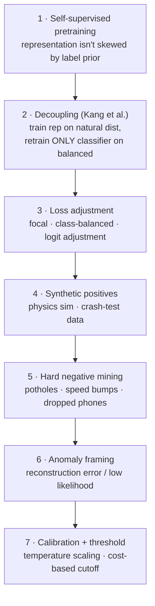

**1. Self-supervised pretraining itself is the biggest lever.** SSL representations are learned without reference to the label distribution, so they are not biased toward the head classes and transfer far better to the tail. **This is the deepest justification for building Atlas at all** — and it's the answer that ties the whole interview together.

**2. Decoupling** (Kang et al., ICLR 2020, *Decoupling Representation and Classifier for Long-Tailed Recognition*). Train the representation on the **natural, imbalanced** distribution — resampling actually *hurts* representation quality. Then freeze it and retrain **only the classifier head** on a balanced sample (cRT) or rescale the classifier weights (LWS). Simple, and it consistently beats end-to-end resampling.

**3. Loss adjustment.**

| Method | Formula sketch | Note |
|---|---|---|
| **Focal loss** (Lin 2017) | $-(1-p_t)^\gamma \log p_t$ | Down-weights easy negatives so the loss isn't dominated by 10⁶ boring trips |
| **Class-balanced** (Cui 2019) | weight $\propto \frac{1-\beta}{1-\beta^{n_c}}$ | Weights by *effective* number of samples, not raw count |
| **Logit adjustment** (Menon 2021) | add $\tau \log \pi_y$ to logits | Provably consistent, nearly free, and **keeps probabilities calibrated** |
| **LDAM** (Cao 2019) | class-dependent margins | Larger margin for rare classes |

**4. Synthetic positives.** Crash-test data, physics simulation, signal-level augmentation of real crashes. Straight from the Phi-4 playbook — treat this as a first-class pipeline, not a hack.

**5. Hard negative mining.** The negatives that matter aren't smooth highway cruising. They're **potholes, speed bumps, door slams, dropped phones, curb strikes, car washes** — events whose accelerometer signature looks like a collision. Mine these deliberately.

**6. Anomaly framing.** Reconstruction error or negative log-likelihood, no labels required. See Part 5.2.

## 6.4 Calibration — non-negotiable here ⭐

The output of this model sets an **insurance price** and triggers an **emergency dispatch**. A score of 0.8 must mean an 80% chance.

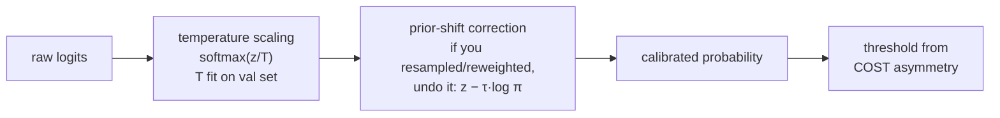

- **Temperature scaling** (Guo et al. 2017): one scalar $T$ fit on a validation set. Cheap, doesn't change the ranking, fixes overconfidence.
- **ECE** (Expected Calibration Error) + **reliability diagrams** — how you measure it.
- ⚠️ **The gotcha to mention:** if you resampled or reweighted during training, you have deliberately shifted the prior. You **must correct it back at inference** (logit adjustment), or your probabilities are systematically wrong even though your ranking is fine. A lot of production systems get this wrong.

## 6.5 The threshold is a business decision, not an ML decision

```
              PREDICTED
              crash        no crash
   crash   │  ✅ help     │  ❌ FALSE NEGATIVE
  ACTUAL   │  dispatched  │  someone doesn't get help
           ├──────────────┼──────────────────────────
no crash   │  ❌ FALSE    │  ✅ nothing happens
           │  POSITIVE    │
           │  wasted      │
           │  dispatch +  │
           │  lost trust  │
```

Say explicitly: *"I'd want the cost ratio from the business before picking an operating point."* That sentence alone marks you as someone who has shipped.

## 6.6 Label noise — the sophisticated point ⭐

Crash ground truth comes from **insurance claims**. Claims are:

- **Delayed** — days or weeks after the event
- **Incomplete** — minor crashes are never claimed
- **Biased** — skewed toward severe, insured, and comprehensively-covered incidents
- **Misaligned** — the claim has a date, not a millisecond timestamp

```
  So: a trip with no claim is NOT a confirmed negative.
      It is UNLABELLED.

  Correct framing:  Positive–Unlabelled (PU) learning
  Wrong framing:    binary classification
```

Treating unlabelled as negative systematically biases the model toward under-predicting crashes and makes your measured precision look artificially bad (your "false positives" include real unreported crashes). Raising PU learning here will genuinely land.

**Say this out loud:** *"Crashes are about one in a hundred thousand trips, so accuracy and ROC-AUC are both useless — I'd report PR-AUC, precision at a fixed recall, and false positives per thousand trips, plus Gini for the risk score. The biggest lever is the self-supervised pretraining itself, because the representation isn't skewed by the label prior. On top of that: decouple — train the representation on the natural distribution and retrain only the classifier on a balanced sample; use logit adjustment so the probabilities stay calibrated; mine hard negatives like potholes and speed bumps; and synthesise positives from crash-test and simulation data. And I'd frame it as positive–unlabelled rather than binary, because a trip without a claim isn't a confirmed negative — minor crashes are simply never reported."*

---

# Part 7 — Evaluation, Deployment, Regulation (20 min)

## 7.1 Evaluating a foundation model

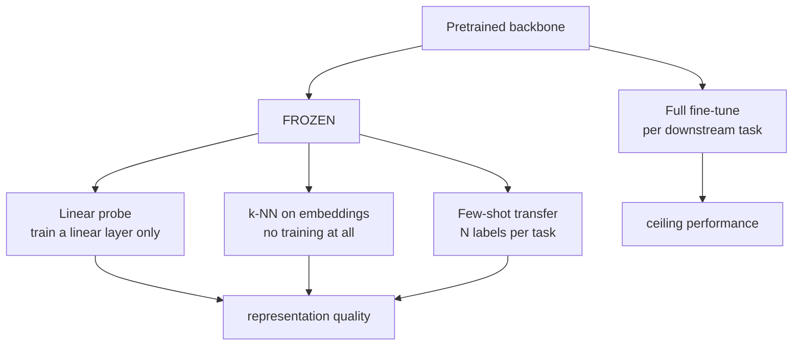

**Linear probe and k-NN on frozen features** is the standard SSL protocol — if the representation is good, a linear layer suffices.

### The splitting rule ⭐

```
  ❌ random split          — consecutive windows in a trip are near-duplicates.
                             Massive leakage. Your numbers will be fiction.

  ✅ split by DRIVER       — no driver appears in both train and test
  ✅ split by DEVICE       — held-out phone models / OS versions
  ✅ split by GEOGRAPHY    — held-out cities/countries: different roads, norms, weather
  ✅ split by TIME         — train on the past, test on the future (the real deployment setting)
```

Say this without being asked. It's the single most common way sensor ML results turn out to be fake.

## 7.2 Deployment — the cascade

Inference has to run within a phone's battery and latency budget, and crash detection has to be near-real-time to be useful for emergency response.

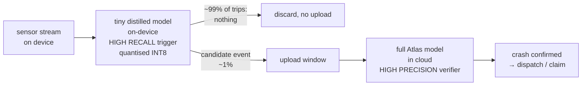

Techniques to name: **knowledge distillation**, **INT8 quantisation**, **pruning**, **early-exit**. The cascade pattern is the important architectural idea — cheap high-recall trigger on device, expensive high-precision verifier in the cloud. It also solves bandwidth and privacy: you only upload the 1% that matters.

## 7.3 Regulation — the point that shows business literacy ⭐

Insurance rates in the US are **filed with and approved by state Departments of Insurance**. They must be explainable, actuarially justified, and free of disparate impact on protected classes. A black-box foundation model generally **cannot set prices directly**.

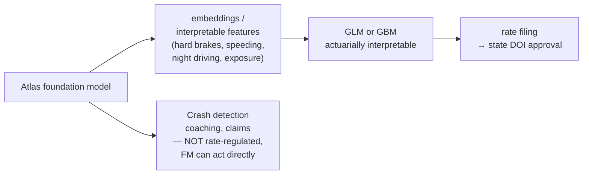

So the FM's job for pricing is to produce **better features**, not the final price. But for crash detection and coaching it can act end-to-end. Knowing where that line sits is a thing very few candidates will mention.

Also relevant: **location data is privacy-sensitive** — GDPR in the EU, state privacy laws in the US. On-device processing isn't just a latency optimisation, it's a privacy architecture.

**Say this out loud:** *"I'd evaluate the backbone with linear probes and k-NN on frozen features, and I'd split held-out data by driver, device, geography, and time — never randomly, because consecutive windows in a trip are near-duplicates and a random split leaks badly. For deployment I'd use a cascade: a distilled, quantised high-recall trigger on device, and the full model in the cloud as a high-precision verifier, which also means you only upload the one percent of data that matters. And for the pricing side, the model probably can't set rates directly — insurance rates are filed with state regulators and have to be explainable, so the realistic pattern is the foundation model producing features that feed an interpretable GLM that gets filed."*

---

# Part 8 — Capstone: Design DriveWell Atlas (30 min)

> **Do not just read this. Write it out from scratch on paper, then attack it.** This is what the interview will actually feel like — he will ask you to design something and then push on it.

## 8.1 The full architecture

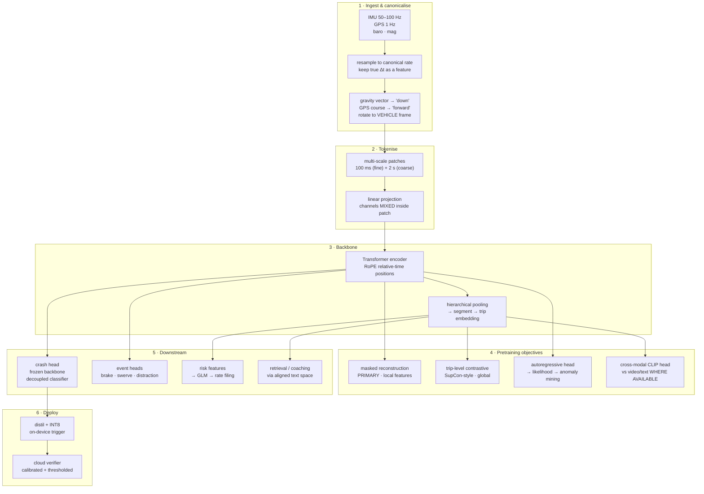

## 8.2 Every choice, with its justification

| Choice | Why | What I'd try if it failed |
|---|---|---|
| Canonicalise to vehicle frame | Otherwise capacity is wasted memorising mounting orientations | Random-rotation augmentation to learn invariance instead |
| Multi-scale patches (100 ms + 2 s) | Events span 50 ms to 20 min; one scale can't cover it | Learned/adaptive patching; or a conv stem before the transformer |
| Channels mixed, not independent | accel x/y/z are one physical vector; braking couples axes | Ablate — if mixing hurts, the canonicalisation is probably broken |
| Continuous patches, not VQ | One stage, lossless; add discreteness only against a requirement | Add RVQ if we need generation or likelihood-based anomaly scoring |
| RoPE relative-time positions | Trips have variable length; relative time generalises better than absolute | Learned absolute + explicit Δt feature |
| Masked reconstruction as primary | Crash-moment detection needs temporally-precise local features | Raise the mask ratio; MAE found 75% works far better than BERT's 15% |
| Trip-level contrastive secondary | Risk scoring needs a stable global embedding, not local features | SupCon with weak labels if pure SimCLR clusters poorly |
| Frozen backbone + light heads | Cheap per-task; proves the representation is actually good | Fine-tune the top N layers if linear probe underperforms |
| Decoupled classifier for crash | Resampling hurts representation but helps the head (Kang et al.) | Logit adjustment as a cheaper alternative |
| Cascade deployment | Battery, bandwidth, latency, and privacy all at once | Adjust the trigger threshold to trade upload volume for recall |
| FM features → GLM for pricing | Rates are regulated and must be explainable | Monotonic GBM with SHAP if the regulator accepts it |

## 8.3 Now attack your own design

Write an answer to each before the interview. He *will* ask some version of these.

1. **"Why not just make it autoregressive end-to-end, like an LLM?"**
   → Autoregressive gives generation and likelihood, but next-patch prediction over a mostly-smooth signal is a weak learning signal — the easy prediction is "roughly the same as last time." Masked modelling with a high mask ratio forces harder inference. I'd keep an AR head as an auxiliary for the likelihood, not as the primary.

2. **"What if your patch sizes are wrong?"**
   → It's an empirical question; I'd ablate against downstream tasks, not reconstruction loss. Reconstruction loss will favour small patches while downstream may not.

3. **"A new phone model ships with a different IMU. What breaks?"**
   → Different noise floor, bias, sample-rate behaviour. Detect it with a device-held-out eval slice and a distribution-shift monitor on the input statistics. Mitigate with device-ID-conditioned normalisation and by including device diversity in the pretraining mix.

4. **"Your VQ codebook collapses. What do you do?"**
   → Standard fixes: EMA codebook updates, codebook restarts for dead entries, lower codebook dimension with a projection, commitment-loss weighting. Or sidestep it — this is a reason to prefer continuous patches unless discreteness earns its place.

5. **"How do you know the pretraining actually helped?"**
   → Linear probe vs a supervised-from-scratch baseline at matched label budgets, plotted as a **label-efficiency curve**. The claim is "we hit the same downstream metric with 10× fewer labels." That's the real FM value proposition and it's measurable.

6. **"You have 10,000 crashes and a billion trips. Where do you actually start?"**
   → Not with the crash head. Start with the backbone on unlabelled data, then spend the 10,000 labels on a decoupled classifier and on validating the representation. Labels are the scarce resource; don't burn them training a backbone.

---

# Part 9 — Rapid-Fire Drill (20 min)

Time yourself. 60–90 seconds each, out loud, no notes.

| # | Question | Your anchor |
|---|---|---|
| 1 | CLIP vs GIT vs LLaVA | Part 1 |
| 2 | What did Florence-2 do, and why do location tokens matter? | Part 2.2 |
| 3 | Explain SupCon and why it beats cross-entropy | Part 2.3 |
| 4 | What's the thesis of Phi-4? | Part 2.4 |
| 5 | What is IMU2CLIP and how would you use it at CMT? | Part 3.1 |
| 6 | How would you tokenise a sensor stream? | Part 4 |
| 7 | Which pretraining objective, and why? | Part 5 |
| 8 | Crashes are 1 in a million. How do you train for that? | Part 6 |
| 9 | How do you evaluate a foundation model? | Part 7.1 |
| 10 | How do you split train/test for driving data? | Part 7.1 |
| 11 | How does this ship to a phone? | Part 7.2 |
| 12 | Design Atlas | Part 8 |
| 13 | **Tell me about your work** | Below ⭐ |

## Question 13 is your closer — rehearse it most

Everything above is knowledge you acquired this afternoon. **This one is experience you actually have.** Frame your DexAI tactile sensing work at ADI in *his* vocabulary:

```
  tactile sensing at ADI              ═══►   telematics at CMT

  high-rate multivariate sensor        ═══►   IMU at 50–100 Hz
  streams from real hardware

  sensor-to-sensor variation,          ═══►   phone model / OS / mounting
  calibration drift, mounting                 position domain shift

  scarce and noisy labels              ═══►   claims-derived crash labels

  real-time inference on               ═══►   on-device trigger models
  constrained hardware

  representation learning over         ═══►   exactly the Atlas problem
  unlabelled sensor logs
```

**Say this out loud:** *"My background is representation learning on tactile sensor streams — high-rate multivariate signals off real hardware, where the hard problems are domain shift between physical devices, calibration drift, scarce and noisy labels, and running inference under tight compute budgets. The telematics problem is the same class: the modality changes from tactile to inertial, but the failure modes are identical. What's new to me is the foundation-model scale, and that's the part I most want to work on."*

That last sentence does real work: it's honest about the gap, and it frames the gap as motivation rather than deficiency. **Do not bluff.** He has an h-index of 72; he will detect it instantly, and "I don't know — here's how I'd find out" scores strictly higher than a confident wrong answer.

---

# Part 10 — Questions to Ask Him

Pick 3–4. The best ones are genuine and technical.

1. **"What's Atlas's pretraining objective, and what surprised you moving from pixels and tokens to sensor streams?"**
   Invites him to talk about his own work. He'll enjoy it, and you'll learn what they actually built.

2. **"How do you evaluate a foundation model when the downstream tasks are rare-event detection and a regulated risk score? Those want very different things from a representation."**
   Shows you've thought past the model to the eval problem.

3. **"Why CMT after Meta GenAI?"**
   Genuinely interesting, and the answer tells you whether this is a real bet or a side project.

4. **"How much of Atlas runs on-device versus in the cloud, and how much does that constraint shape the architecture?"**
   Signals you think about shipping, not just training.

5. **"What does an MLE II actually own here — pretraining infrastructure, downstream heads, or evaluation?"**
   Practical; tells you what the job is.

6. **"Do you have paired modalities — video, vehicle CAN data, map context — or is it sensor-only? That seems like it'd change the whole approach."**
   Sophisticated, and directly sets up the IMU2CLIP conversation.

---

# One-Page Cheat Sheet
### Read this the morning of. Nothing else.

**HIM** — IEEE Fellow, h-index 72. MIT PhD under Bill Freeman, on *motion analysis*. Google → Microsoft → Meta GenAI → CMT. SIFT Flow · Motion Magnification · SupCon · MaskGIT · Florence/Florence-2 · GIT · Llama 3 · Movie Gen · Phi-4. **He values: simple architectures, excellent data, first-principles reasoning. He detects bluffing.**

**THEM** — Smartphone telematics + DriveWell Tag. Risk / Crash & Claims / Engage / Fusion. **DriveWell Atlas = foundation model for mobility intelligence = the job.** Customers: State Farm, Progressive, Nationwide, Travelers, AXA, Uber, Verizon.

**THE LADDER**
```
SupCon      contrastive, labels give you many positives
CLIP        contrastive, two modalities, shared embedding space
GIT         encoder + text decoder, ONE generative loss, trained jointly
LLaVA       frozen encoder + projector + frozen LLM
Florence-2  every vision task = prompted seq2seq + LOCATION TOKENS + DATA ENGINE
Phi-4       no vision; DATA QUALITY IS THE MODEL
IMU2CLIP    CLIP with an IMU encoder — the closest thing to Atlas
```

**FIVE IDEAS THAT TRANSFER**
1. Quantise continuous values into vocabulary tokens (location tokens → sensor tokens)
2. Unify the task zoo behind one prompted seq2seq interface
3. Build an automated data engine; don't hire labellers
4. Synthetic data is a first-class strategy, not a fallback
5. Small models with great data beat big models with average data

**FIVE THINGS TO RAISE UNPROMPTED** (these are your credibility signals)
1. **Coordinate frame** — gravity vector + GPS heading → vehicle frame, or learn rotation invariance
2. **Multi-scale patches** — 50 ms crash impulse to 20 min trip is five orders of magnitude
3. **Split by driver / device / geography / time** — never randomly; consecutive windows leak
4. **Positive–unlabelled, not binary** — a trip with no claim is not a confirmed negative
5. **Regulation** — FM produces features → interpretable GLM → filed with state DOI

**METRICS** — PR-AUC not ROC-AUC · precision @ fixed recall · **FP per 1,000 trips** · **Gini / lift** for risk · ECE for calibration

**LONG-TAIL RECIPE** — SSL pretraining (biggest lever) → decouple (Kang: natural-dist representation, balanced classifier) → logit adjustment → hard negatives (potholes, speed bumps) → synthetic positives → temperature-scale → threshold from cost asymmetry

**YOUR CLOSER** — *tactile sensing = high-rate multimodal sensor streams, device-to-device domain shift, noisy labels, edge deployment. Same problem class. The FM scale is what's new, and it's what I want.*

**IF YOU DON'T KNOW** — *"I don't know. Here's how I'd find out."* Always beats a confident wrong answer.

---

## Glossary

| Term | Meaning |
|---|---|
| **InfoNCE** | The standard contrastive loss: identify the positive among a batch of negatives |
| **SupCon** | Supervised contrastive — all same-class samples count as positives |
| **MAE** | Masked Autoencoder — mask ~75% of patches, reconstruct them |
| **VQ-VAE / RVQ** | Vector-quantised autoencoder; residual VQ stacks codebooks for fidelity |
| **Codebook collapse** | Most codebook entries go unused; fixed with EMA updates and dead-code restarts |
| **RoPE** | Rotary position embedding — encodes *relative* position, generalises to longer sequences |
| **Linear probe** | Freeze the backbone, train only a linear layer — the standard SSL quality test |
| **Focal loss** | $-(1-p_t)^\gamma \log p_t$ — down-weights easy examples |
| **Logit adjustment** | Add $\tau\log\pi_y$ to logits to correct for class prior; keeps calibration |
| **Decoupling (cRT)** | Train representation on natural distribution, retrain classifier on balanced data |
| **ECE** | Expected Calibration Error — gap between confidence and accuracy |
| **PR-AUC** | Area under precision–recall; the honest metric under class imbalance |
| **Gini / lift** | Insurance-standard measures of how well a score separates risk |
| **PU learning** | Positive–Unlabelled: you have positives and unlabelled data, not true negatives |
| **Distillation** | Train a small student to match a large teacher's outputs |
| **Cascade** | Cheap high-recall model filters; expensive high-precision model confirms |
| **Domain shift** | Train/deploy distribution mismatch — here: device, geography, time, driver |
| **Data engine** | Model-in-the-loop automatic annotation that improves as the model improves |

---

*Prepared 17 Sep 2026 · for the 18 Sep 2026 interview with Ce Liu, CMT.*
